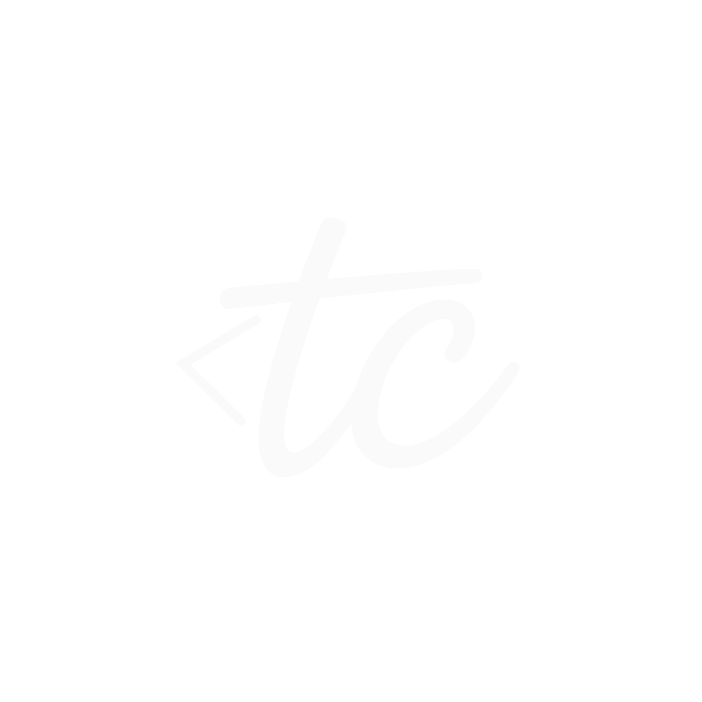

<!-- github.com/wiktorekdev -->

# wiktorekdev

**desktop tools · browser apps · local-first**

I build small products with a clear job. TypeScript by default, Rust when desktop needs it.

---

## Projects

### &nbsp;[GeoHelper](https://github.com/wiktorekdev/geohelper)

Steam GeoGuessr companion. Live coords, place details, map preview, themes, edit mode. CDP, no injection.

[Site](https://geohelperapp.vercel.app/) · [Repo](https://github.com/wiktorekdev/geohelper) · [Download](https://github.com/wiktorekdev/geohelper/releases/latest)

### &nbsp;[Typecast](https://github.com/wiktorekdev/typecast)

Image to binary, ASCII, and character art. Zoom stage, color modes, HD-8K export. 100% local browser.

[Site](https://typecast2.vercel.app) · [Repo](https://github.com/wiktorekdev/typecast)

---

local-first when privacy matters · honest about ToS · public when ready

